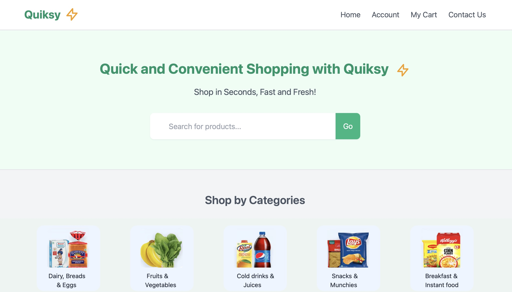
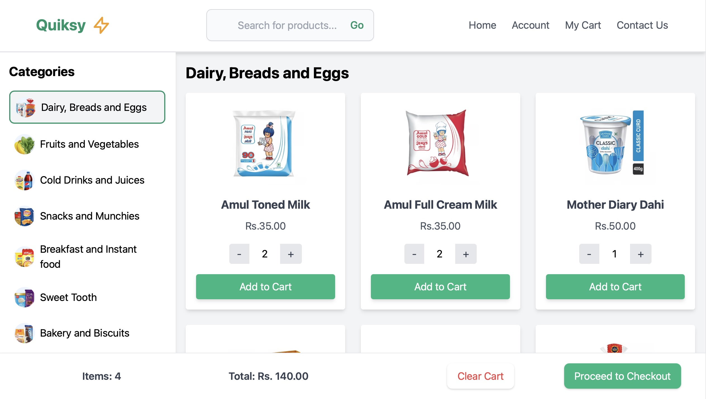

# Quiksy⚡
Quiksy is a quick commerce platform designed to provide fast and seamless online shopping experiences. The platform allows users to browse categories, add items to their cart, and complete purchases efficiently. It features a user-friendly interface, optimized search functionality, and an account dashboard for order management.  

## Tech Stack  
- **Frontend:** HTML, Tailwind CSS, JavaScript  
- **Backend:** PHP, MySQL  
- **APIs:** REST APIs for dynamic content handling  
- **Tools:** Visual Studio Code, Git/GitHub  
- **Platform:** Deployed locally using XAMPP  

## Features  
- Categories and product display with dynamic MySQL integration  
- User account management system using session handling in PHP  
- Shopping cart handling with AJAX
- Simple and responsive UI design  

## Demo   

  

## Contributors 
Special thanks to
**[@Yugal-Gahlout](https://github.com/YUGAL-GAHLOUT)**
and **[@Sanyam-Jain](https://github.com/sanyamjain1111)** for their contributions to designing and developing the frontend UI.
